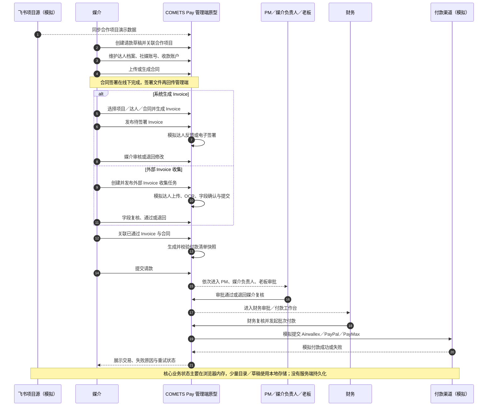
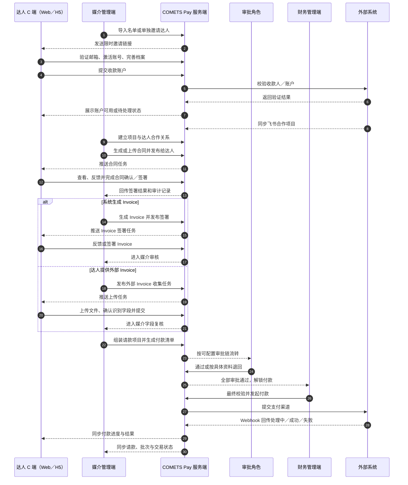
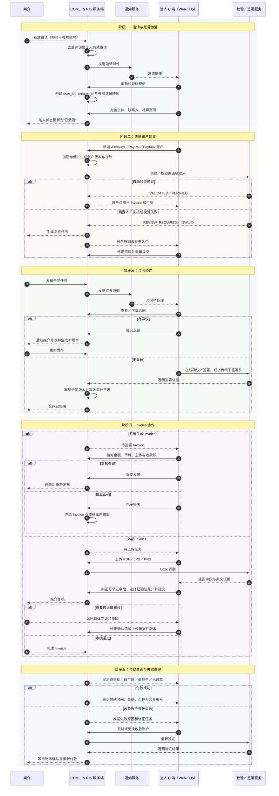
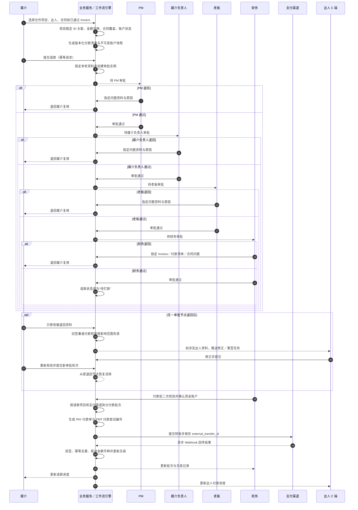
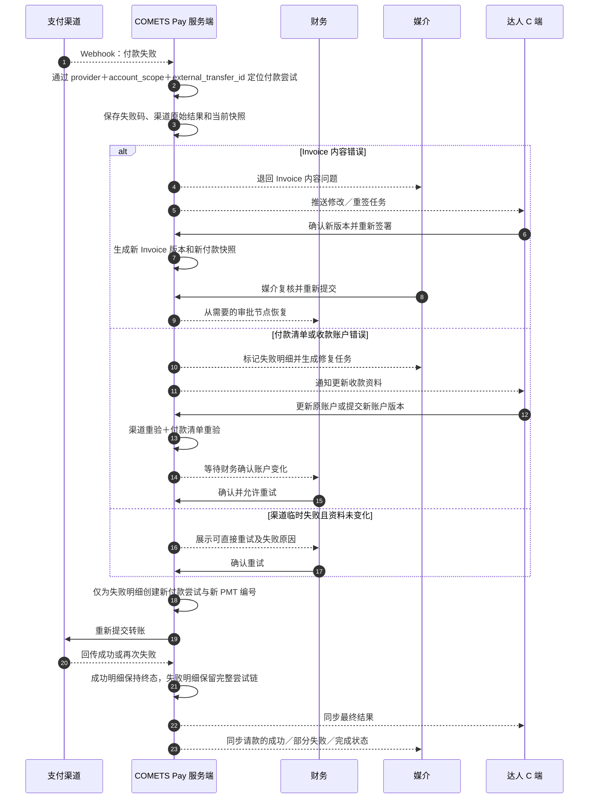

# COMETS Pay 系统流程泳道图

版本：V1.0  
适用场景：产品经理向研发讲解当前系统、达人 C 端接入目标、审批付款闭环与异常恢复  
目标 C 端：响应式 Web / H5  

## 1. 阅读口径

- 本文先讲“当前管理端原型”，再讲“接入达人 C 端后的目标系统”，两者不能混为一谈。
- 当前应用是纯前端高保真原型：没有真实后端、数据库、服务端鉴权、持久化、支付渠道或 Webhook。
- 目标系统由管理端和达人 C 端共享同一套服务端业务数据，但通过服务端 RBAC、数据范围与独立会话隔离权限。
- 默认请款审批链为“PM → 媒介负责人 → 老板 → 财务”，后台允许按组织配置节点；流程图展示默认链。
- 泳道图中的实线箭头表示业务请求或操作，虚线箭头表示通知、回执或状态同步。

## 2. 当前管理端原型流程（AS-IS）

> 讲解重点：页面和状态较完整，但所有关键能力仍在浏览器内模拟；当前没有独立达人 C 端。

## 3. 目标端到端业务闭环（TO-BE 总览）

> 讲解重点：达人不再是管理端中的“模拟动作”，而是独立用户；`creator_id` 将两端的项目、合同、Invoice、收款账户和付款记录串成同一条业务链。

## 4. 达人 C 端全生命周期泳道

> 讲解重点：C 端首期采用邀请制 Web/H5；达人只能访问自己的档案、合作与单据，不能看到内部审批意见、其他达人或公司资金账户。

## 5. 请款审批与付款执行泳道

> 讲解重点：提交请款时冻结单据和付款清单版本；任一节点退回都只开放被退回的资料，修改后重新校验并从退回节点继续。

## 6. 异常退回与付款失败恢复泳道

> 讲解重点：修改已签署或已提交的资料不能“原地覆盖”；必须产生新版本、重新验证，并保留旧版本和每次付款尝试。

## 7. 研发落地边界

| 能力域 | 当前原型 | 目标系统必须补齐 |
| --- | --- | --- |
| 身份与权限 | 前端账号和角色判断 | 服务端会话、邀请制达人账号、RBAC、数据范围、登录风控 |
| 数据持久化 | React 内存与少量本地草稿 | 业务数据库、对象存储、版本记录、并发控制、备份恢复 |
| 达人身份 | 档案记录，部分模拟邀请 | 永久 `creator_id`、`external_identity`、同名/改名安全关联 |
| 合同与 Invoice | 浏览器生成、解析和模拟签署 | 服务端文件存储、版本、签署证据、OCR、审计和访问授权 |
| 收款账户 | 前端表单和模拟校验 | 敏感字段加密、脱敏、账户版本、渠道 beneficiary 校验、最小可见范围 |
| 审批 | 固定客户端状态机 | 可配置工作流、服务端状态机、退回范围、幂等提交、操作审计 |
| 付款 | 模拟渠道与结果 | 支付渠道 API、签名验签、Webhook 幂等、对账、异常队列与重试 |
| 通知 | 模拟站内信／邮件 | 邮件与站内通知服务、模板、发送记录、失败重试和已读状态 |
| 安全与运维 | 静态 HTTP 原型 | TLS、密钥管理、日志脱敏、监控告警、审计留存和灾备 |

## 8. 核心数据与接口约束

- `creator_id` 是达人唯一身份，必须贯穿合作关系、合同、Invoice、请款、付款单与收款账户；姓名、邮箱、Handle 只能用于展示和人工核验。
- 达人 C 端只提交内部 UUID；外部系统身份通过 `(external_system, external_tenant_id, external_creator_id)` 映射，不允许按姓名临时匹配。
- Invoice 完成签署或外部 Invoice 审核通过时，冻结金额、币种、主体、账户版本和账户指纹；后续修改生成新版本。
- 只有 `VALIDATED` 或 `VERIFIED` 的收款账户可以进入 Invoice 和付款清单。
- 请款提交、审批动作、付款提交和 Webhook 均使用幂等键；重复请求不得重复建单或重复付款。
- 付款回调通过 `provider + provider_account_scope + external_transfer_id` 定位交易，并校验金额、币种与终态。
- 审计日志记录操作者、对象 ID、业务编号、前后状态、时间和原因；不得记录完整银行账号、证件或密钥。

建议的关键领域事件：

| 事件 | 触发方 | 主要消费方 |
| --- | --- | --- |
| `creator.invited` / `creator.activated` | 达人服务 | 通知、媒介工作台、审计 |
| `payout_account.submitted` / `payout_account.validated` | 达人服务／渠道适配器 | C 端、媒介、Invoice 服务 |
| `contract.published` / `contract.signed` | 合同服务 | C 端、媒介、通知、审计 |
| `invoice.collection_published` / `invoice.submitted` / `invoice.approved` | Invoice 服务 | C 端、媒介、请款服务 |
| `payment_request.submitted` / `returned` / `approved` | 工作流服务 | 审批人、媒介、财务、通知 |
| `transfer.submitted` / `succeeded` / `failed` | 支付编排／渠道适配器 | 财务、媒介、C 端、交易记录 |

## 9. 研发评审建议讲解顺序

1. 先用“AS-IS”说明当前页面能力完整，但所有核心状态都在前端模拟，不能直接承载真实付款。
2. 再用“TO-BE 总览”说明真正的闭环是“邀请达人 → 档案与账户 → 合同 → Invoice → 请款审批 → 付款 → 状态回传”。
3. 用“达人 C 端全生命周期”明确达人可做什么、不可看到什么，以及所有修改都需要版本和审计。
4. 用“请款审批与付款执行”锁定默认审批链、退回恢复点、付款前二次校验和渠道回调。
5. 最后用“异常恢复”强调系统不能覆盖历史数据，重签、重验和重付都必须产生新版本或新尝试。

首期范围默认包含：邀请制 C 端、达人档案、收款账户、合同任务、两类 Invoice、付款进度和账户失败修复。首期不包含原生 App、小程序、开放注册、达人主动发起付款、达人查看内部审批意见或公司资金账户。
